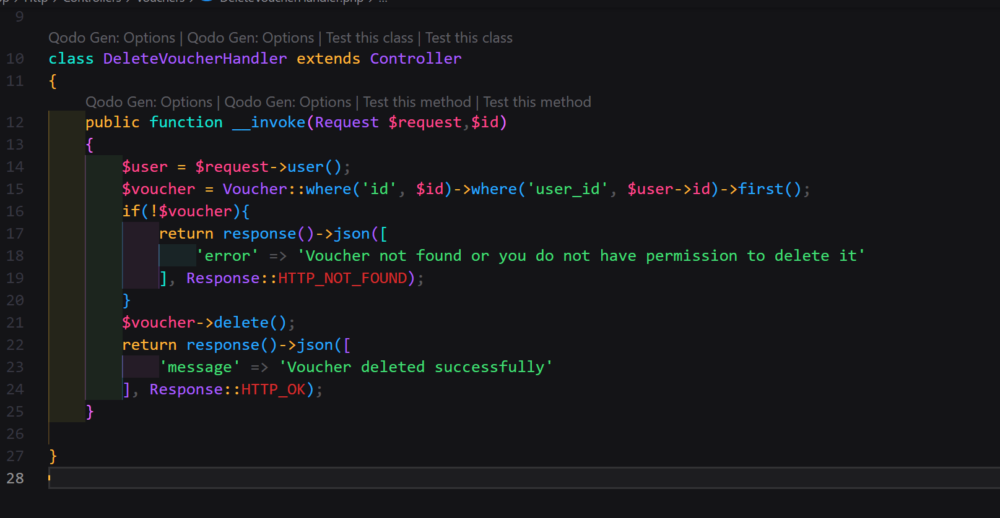

# Technical_test_BJunior
- Prueba técnica en PHP/Laravel para evaluar conocimientos en los requisitos requeridos

> [!IMPORTANT]  
> El proyecto base se levanto mediante la configuracion de docker brindada por el equipo de desarrollo de la empresa.

# Desarrollo de la prueba técnica
## 1. Almacenamiento de Información Adicional en Comprobantes
- La API debe permitir guardar datos adicionales al registrar comprobantes, incluyendo serie, número, tipo de comprobante y moneda. Además, se requiere regularizar los comprobantes existentes, extrayendo esta información desde el campo xml_content de la tabla vouchers para integrarla en el sistema.

### Paso 1: Crear una migración para agregar los campos necesarios a la tabla vouchers

```php
php artisan make:migration add_fields_to_vouchers_table
```

> [!NOTE]  
> En el archivo de migración agregamos los campos **serie**, **numero**, **tipo de comprobante** y **moneda** a la tabla **vouchers**.


- Se procedio a mandar a ejecutar la migración creada:
```php
php artisan migrate
```

> [!NOTE]  
> Se procedio a modificar el archivo **Voucher.php** para agregar los campos **serie**, **numero**, **tipo de comprobante** y **moneda** a la tabla **vouchers**.


### Paso 2: Se modifico el archivo VoucherService.php

> [!NOTE]  
> Se procedio a mapear los campos **serie**, **numero**, **tipo de comprobante** y **moneda** en el archivo **VoucherService.php** teniendo en cuenta la estructura de los archivos XML.
> Esto nos ayudara a almacenar la información adicional en la base de datos.
> Se hizo una validacion para verificar si ya existe un voucher en la base de datos basado en el contenido del XML es decir **$xmlContent** y asi se actualize agregando los campos adicionales o se cree un nuevo voucher.

- Evidencia con postman:


## 2. Procesamiento Asíncrono de Comprobantes
- Actualmente, el registro de comprobantes se ejecuta en primer plano. Este proceso debe modificarse para realizarse en segundo plano mediante procesamiento asíncrono, mejorando así la eficiencia y respuesta de la API
- También es necesario actualizar el resumen enviado por correo al finalizar el procesamiento, de manera que incluya:
    - Un listado de comprobantes registrados exitosamente.
    - Un listado de comprobantes que no se pudieron registrar, indicando la razón de cada fallo.


> [!CAUTION]
> El requerimiento presentó desafíos relacionados con el procesamiento de vouchers en segundo plano y la implementación de jobs en Laravel. 
> Sin embargo, se avanzó significativamente en la implementación del requerimiento, lo que permitió obtener aprendizajes clave sobre el manejo de estas tecnologías. 
> A continuación, se explicará brevemente el proceso realizado y los pasos tomados para abordar estas dificultades

### Paso 1: Crear un Job para procesar los vouchers en segundo plano

```php
php artisan make:job ProcessVouchers
```
- Una captura del archivo **ProcessVouchers.php**:

|

### Paso 2: Configurar la cola de trabajos en el archivo .env

```php
QUEUE_CONNECTION=database
```

### Paso 3: Aprovechamos el Events,Listeners,Mail y la vista para el envio de correos

### Paso 4: Dispatch del Job en el controlador StoreVouchersController.php

- Una captura del archivo **StoreVouchersController.php**:


### Paso 5: Crear la tabla failed-table y probar el envio de correos

```php
php artisan queue:failed-table
php artisan migrate
```
#### Utilizar los comandos para probar el envio de correos

```php
php artisan queue:failed
php artisan queue:retry all
php artisan queue:work
```
- Error al enviar el correo:


## 3. Consulta de Montos Totales Acumulados por Moneda
- Implementar un endpoint que permita consultar los montos totales acumulados de los comprobantes registrados por el usuario autenticado, desglosados en soles y dólares. No se requiere realizar una conversión entre las divisas.
### Paso 1: Se procede a crear un nuevo controlador llamado **GetTotalAmountsController.php**

```php
php artisan make:controller GetTotalAmountsController
```
### Paso 2: Se procede a crear una nueva ruta y desarrollo del controlador


## 4. Eliminación de Comprobantes por Identificador
- Incorporar una funcionalidad que permita al usuario autenticado eliminar comprobantes específicos utilizando su identificador (ID). Esto deberá aplicarse solo a los comprobantes registrados por el mismo usuario, respetando las reglas de autorización.

### Paso 1: Se procede a desarrollar el controlador vacio **DeleteVoucherController.php**




## 5. Filtros Avanzados en la Consulta de Comprobantes
- Modificar el endpoint de listado de comprobantes para que soporte los siguientes filtros opcionales: serie, número, tipo de comprobante, moneda y rango de fechas. El rango de fechas es el único filtro obligatorio y debe aplicarse sobre la fecha de registro de los comprobantes. Además, la consulta debe limitarse para que el usuario autenticado solo pueda acceder a los comprobantes que él mismo haya registrado.
### Paso 1: Los filtros pedidos se desarrollaron en VoucherService.php


> [!NOTE]  
> Muchas gracias por la oportunidad de realizar esta prueba técnica, fue un desafío interesante y me permitió aprender mucho sobre el manejo de Jobs en Laravel y el procesamiento asíncrono de tareas.